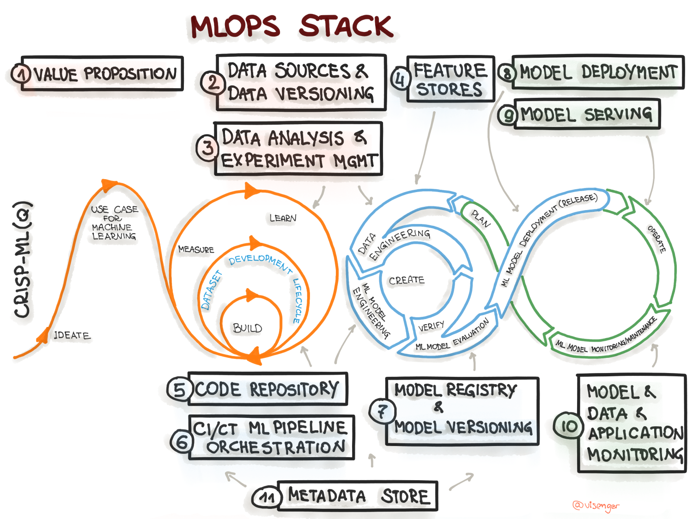
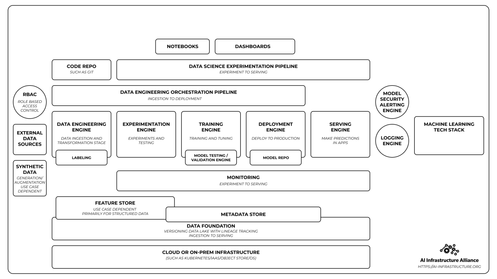

## Pieces

- Distributed data storage
- Distributed computing 
   - Task parallellism
      - [https://spark.apache.org/docs/latest/rdd-programming-guide.html#rdd-operations](https://spark.apache.org/docs/latest/rdd-programming-guide.html#rdd-operations)
      - [https://examples.dask.org/applications/embarrassingly-parallel.html#Use-Dask-Delayed-to-make-our-function-lazy](https://examples.dask.org/applications/embarrassingly-parallel.html#Use-Dask-Delayed-to-make-our-function-lazy)
   - Data Parallelism
- Hadoop ecosystem
- Spark
- Dask: [Dask](https://dask.org/) is an open-source parallel computing framework written natively in Python (initially released 2014). It has a significant following and support largely due to its good integration with the popular Python ML ecosystem triumvirate that is NumPy, Pandas, and Scikit-learn. 

## Table of Contents

## ML workflow

## ML stack

## Reference

1. [A comprehensive survey on machine learning for networking: evolution, applications and research opportunities](https://rboutaba.cs.uwaterloo.ca/Papers/Journals/2018/BoutabaJISA18.pdf)
2. [AI Infrastructure Ecosystem of 2022](https://ai-infrastructure.org/ai-infrastructure-ecosystem-report-of-2022/)
3. [AI Infrastructure Landscape](https://ai-infrastructure.org/ai-infrastructure-landscape/)
4. [Why We Started the AIIA and What It Means for the Rapid Evolution of the Canonical Stack of Machine Learning](https://ai-infrastructure.org/why-we-started-the-aiia-and-what-it-means-for-the-rapid-evolution-of-the-canonical-stack-of-machine-learning/)
5. [Distributed model training using Dask and Scikit-learn - Cloudera Blog](https://blog.cloudera.com/distributed-model-training-using-dask-and-scikit-learn/)
